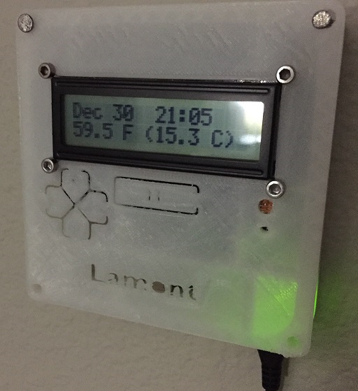

# Vera Endnode A README

Wall mounted End node for the Vera using a Raspberry Pi Zero W, Adafruit Arduino RGB 16x2 LCD shield, and a splash of python. Selectable Vera modes, displays the date time, weather, and the current mode when changed with an appropriate colour.

I was fed up using the app, and wanted to do something that gave me a bit more control about the home. After a short rummage I found an adafruit shield (for arduino of course), and after a bit of tinkering found that its really important to use appropriate code for the chip you are using (who knew?). The node uses the 5 buttons on the shield, matched with the vera modes and colours. To quiet the wifey I printed a case to mount it flat to the wall making it more palletable to look at. 

I used physical pins 4(5V) 6 (GND) 3(Data SDA) 6(Clock SCL) on the raspberry pi. Make sure you run raspi-config to change the hostname (for tracking multiple nodes), password, and enable I2C used by the MCP chip. 

After building one type of node, to build a second of the same I usually scp (scp -r /home/pi/lcd (newnode):/home/pi/) the runtime directory to a new node from one of the already running nodes and run all of the install steps. I know I am lazy.

Endnode A/B

Endnode A is a Raspberry Pi Zero W or Raspberry Pi 3 using an Adafruit MCP23017 shield (5 buttons and RGB)
https://www.adafruit.com/product/716

Endnode B is a Raspberry Pi Zero W or Raspberry Pi 3 using an Adafruit MCP23008 LCD Backpack
https://www.adafruit.com/product/292

This was built on Raspbian Stretch lite in late 2017
***************************************************************************************
For LCD Shield (MCP23018) (A)
	
  $ cd ~/
	$ git clone https://github.com/adafruit/Adafruit_Python_CharLCD.git

-Rename the Adafruit directory to make things simpler

	$ mv Adafruit_Python_CharLCD/ lcd/

-Enter the relevant directory

	$ cd ~/lcd

-Install the prereqs

	$ sudo python ez_setup.py

-Install the libraries

	$ sudo python setup.py install

-Needed libraries and plugins
	
	$ sudo apt-get install build-essential python-dev python-smbus python-pip

-Enable GPIO for Python

	$ sudo pip install RPi.GPIO

-Check to see if I2C is functional, you should see 0x20 lit up

	$ sudo i2cdetect -y 1

Error here? (Not seeing 0x20 lit up) Most likely 1) you wired it up wrong, check your pins (DA,CLK) or 2) you forgot to enable I2C above. If that doesnt fix it look for cold solder joints.

-Enter the examples directory and test the LCD shield
	
	$ cd ~/lcd/examples/
	$ python char_lcd_rgb.py

Error here? Try adjusting your contrast pot on the back of the shield while the script is running. If you see the backlight flash and no characters, there is your smoking gun.

-Create your runtime, then copy and paste the Node A code into it, save and exit
	
	**CHANGEME! - Dont forget to add your Vera address and Wunderground API key where annotated**
	$ vi lcd_runtime.py

-Test it

	$ python lcd_runtime.py

-Now to have it run once the RPI boots up

	$ chmod 755 lcd_runtime.py

-Test it

	$ ./lcd_runtime.py

-Error here (import: command not found etc)? Its most likely the case that the shebang (#!/usr/bin/env python) either is missing or not on the very first line of the script.

-Add it to rc.local
	
	$ sudo nano /etc/rc.local

-Add this atthe bottom of the file but before 'exit 0'
  
	$ /home/pi/lcd/lcd_runtime.py &

# FIN.

______________________________________________________________________________________________
